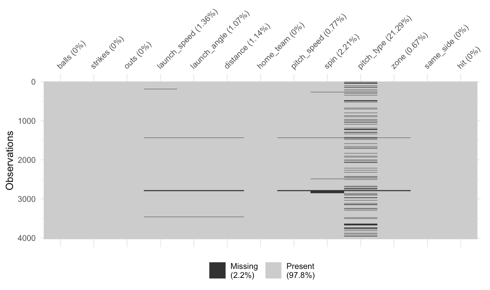

```{r setup, include=FALSE}
knitr::opts_chunk$set(echo = FALSE)
```

```{r packages, include=FALSE}
library(tidyverse)
library(baseballr)
library(knitr)
library(naniar)
library(patchwork)
```

```{r data}
#read rds
pbp2022 <- readRDS("data.rds")


#selecting and cleaning variables
pre_main <- pbp2022 %>% 
  select(count.balls.start, count.strikes.start, count.outs.start, hitData.launchSpeed, hitData.launchAngle, hitData.totalDistance, result.event, matchup.batSide.description, matchup.pitchHand.description, home_team, batting_team, pitchData.endSpeed, pitchData.zone, pitchData.breaks.spinRate, details.type.description) %>% 
  rename(balls = count.balls.start, strikes = count.strikes.start, outs = count.outs.start, launch_speed = hitData.launchSpeed, launch_angle = hitData.launchAngle, bat_side = matchup.batSide.description, pitch_side = matchup.pitchHand.description, pitch_type = details.type.description, pitch_speed = pitchData.endSpeed, spin = pitchData.breaks.spinRate, distance = hitData.totalDistance) %>% 
  mutate(zone = ifelse(pitchData.zone < 10, TRUE, FALSE),
         same_side = ifelse(bat_side == pitch_side, TRUE, FALSE),
         home_team = ifelse(home_team == batting_team, TRUE, FALSE),
         hit = ifelse(result.event == "Single" | 
                        result.event == "Double" | 
                        result.event == "Triple" | 
                        result.event == "Home Run", TRUE, FALSE),
         pitch_type = case_when(
           pitch_type %in% c("Curveball", "Knuckle Curve", "Eephus", "Slow Curve", "Slider") ~ "Breaking Ball",
           pitch_type %in% c("Fastball", "Four-Seam Fastball", "Cutter", "Splitter") ~ "Fastball",
           pitch_type %in% c("Changeup") ~ "Changeup")) %>% 
  filter(batting_team == "Chicago Cubs") %>% 
  select(-c(pitchData.zone, batting_team, bat_side, pitch_side, result.event))

main <- pre_main %>% 
  mutate(pitch_type = ifelse(is.na(pitch_type), "Missing", pitch_type)) %>%
  drop_na()
```

# Introduction

Baseball is the ultimate statistical sport. Everything in the game seems to fit perfectly in a box and is automatically quantified. Following 'Moneyball,' teams across Major League Baseball began defining the basis on their team building strategy on statistics and models. Through the abundance of statistics in the game, we are able to beat the 'eye test,' which is a revelation that is still fighting its way into other sports. Recently, further advancements in pitch tracking technology have allowed baseball statisticians to find new ways to quantify and simplify complex interactions between the bat and the ball on any given pitch.

One aspect of hitting that teams universally care about is putting the ball in play. It is understood that, generally, good things happen when the ball is put into play. Being put into play is classified as any time the ball is active off a pitch. For the purpose of this study, this means when the batter makes contact with the ball and the ball goes into the field of play, the ball is 'in play.' These balls in play can either result in a hit (a single, double, triple or home run) or an out.

The analysis in this paper seeks to delve into the aspects of a single pitch that benefit the chances of that ball being put into play for a hit by creating a model that attempts to predict the probability of a ball in play becoming a hit. These aspects include game situation variables, as well as pitch characteristics and hit characteristics. The model does not explore any prior information on the batter or pitcher to generalize the resulting information. This modeling is important for two reasons. First, players can better understand aspects of the game they need to be focusing on to improve. Batters always want to increase there chances of getting hits and pitchers always want to find ways to get outs. Additionally, team general managers and coaches are always looking for ways to improve their rosters and an analysis like this may be able to help them look over their team and find the areas that need improvement by seeing which players are good or bad at certain aspects. While this paper focuses on the inference side of modeling, in theory, with enough data and variables, it could have predictive applications as well.

We believe there will be statistically significant evidence of certain aspects affecting the probability of generating hits. Mainly, we believe that bat-contact statistics will prove to have far larger effects than game state or pitching statistics.

The data is collected from the `baseballr` package using their pre-built web scrapping functions of play-by-play data that can reach any game from any year that has recorded play-by-play data. The package scrapes from baseball-reference.com and baseballsavant.com to get the information as well as advanced statistics. However, due to the difficulty of data collection and sheer number of balls put in play in 2022 across the league. We have chosen to look at only balls in play by the Chicago Cubs last season. Due to this, there cannot be sweeping generalizations made about the game of baseball and the league as a whole, but rather we focus on the applicability of the results to the Cubs only.

## Explaratory Data Analysis

Our exploratory data analysis focuses both on better understanding the data, as well as uncovering potential relationships in the variables for possible interaction terms later on in our model. In exploring the pitching-related variables, it is apparent in Figure 1 that the combination of spin and pitch speed reveal the grouping of pitch types. This makes sense because speed and spin often dictate the classification of pitches. However, different pitchers throw each pitch type differently and thus groupings span large areas. 

In Appendix Figure A, we also explore the breakdown of pitch type mixing by batter-pitcher handedness, ball and strike counts. The most noticeable attribute there is the flexible use of changeups and breaking balls. Pitchers on the same side as the batter move away from changeups and lean more heavily on breaking balls. Additionally, pitchers love to lean more on off-speed pitches in "safer" counts (i.e. low balls, high strikes) and turn more heavily to fastballs in tougher counts (high balls, low strikes).

```{r pitching, fig.align='center', fig.height=3, fig.width=5}
ggplot(data=main, aes(x=pitch_speed, y = spin, color = pitch_type)) + 
  geom_point() +
  labs(title = "Figure 1: Pitch Segmentation", x="Speed (MPH)", y="Spin (RPM)",
       color = "Pitch Type")
```

When it comes to batting, the center of our EDA focuses on visualizing evidence of a "sweet spot." It is immediately apparent from Figure 2 that a line of hits in the 12-24 degree range is almost invariable to the speed at which they are hit. Additionally, as balls reach a certain exit velocity, the hits spread and angle seems to matter less. 

In Appendix Figure B, we relate distances to hits. In those graphs, there are two very distinct and interesting shapes. As we explore launch angle, it is apparent there is a very strict distance each launch angle travels. In the 25-50 degree range there is a bit more variability, but we also see a dead-spot in distance, where we can assume the outfields catch most balls. When exploring launch speed, there is a clear maximum distance associated with each speed, however there is much more randomness to whether each ball was caught. We do see the similar dead-spot in distance at around 300 feet. 

```{r hitting, fig.align='center', fig.height=3, fig.width=5}
ggplot(data=main, aes(x=launch_angle, y=launch_speed, color=hit)) +
  geom_point() +
  labs(title = "Figure 2: Batting 'Sweet Spot' Mapping", x="Launch Angle (Degrees -- 0 is plane of bat)", y="Launch Speed (MPH)",
       color="Hit")
```


# Methodology

## Variable Selection and Alteration

The main method of variable selection is based on domain baseball knowledge. We avoided using any type of automatic selection in order to prevent maximizing or minimizing an arbitrary statistic. Our approach to variable selection involved using variables from the three different aspects of an at-bat: game state, pitching, and hitting.

### Target Variable:

* Hit: Created indicator if a hit was recorded regardless of the type of hit (TRUE for yes, FALSE for no). 

### Game State:

* Ball Count: The number of balls in the at-bat at time of the pitch. Modeled as a factor with levels 0, 1, 2 and 3. Selected because the count of the at-bat may dictate a batter's approach to the next pitch.
* Strike Count: The number of strikes in the at-bat at time of the pitch. Modeled as a factor with levels 0, 1 and 2. Selected because the count of the at-bat may dictate a batter's approach to the next pitch.
* Out Count: The number of outs in the inning at time of the pitch. Modeled as a factor with levels 0, 1 and 2. Selected because the outs going into the at-bat may dictate a batter's approach to the at-bat.
* Is Home Team: Created, set to TRUE if the better is on the home team and FALSE if on the away team. Selected for investigation into home field advantage claims, as seen in a 2013 Bleacher Report Article [https://bleacherreport.com/articles/1803416-is-home-field-advantage-as-important-in-baseball-as-other-major-sports].
* Pitcher-Batter Same Handed: Created, set to TRUE if the pitcher and batter are both righties or lefties, FALSE if they are different. Selected because throwing from the same side as a hitter is generally considered an advantage for a pitcher. 

### Pitching:

* Pitch Type: Created, the kind of pitch that was thrown. Grouped specific pitch types together into Fastball, Breaking Ball, Changeup or Missing (see missing data paragraph) to simplify the output and account for certain pitchers only throwing certain types of pitches. Selected because pitch type can dictate how a batter swings and makes contact with a ball.
* Pitch Speed: The speed of the pitch in MPH. Selected because certain pitch speeds may be harder to hit, especially when combined with pitch type.
* Spin Rate: The spin rate of the pitch in RPM. Selected because certain pitch spins may cause more movement, especially when combined with pitch_type.
* In Strike Zone: Created variable to indicate whether the pitch was in the strike zone (TRUE for yes, FALSE for no). Created from the given `pitchData.zone` variable which provides the numbered zone in which the ball passed through (1-13, 1-9 is theoretical strike zone). Selected because pitches in the zone are, in theory, more likely to be hittable than pitches outside the zone.

### Hitting:

* Launch Speed: Exit velocity for which the ball left the bat (MPH). Selected because exit velocity may cause the ball to travel farther or escape the reach of defenders.
* Launch Angle: Angle at which the ball left the bat, with 0 being the perpendicular plane of the bat (degrees). Selected because the angle at which the ball leaves the bat can either cause an easy out on a popout/flyout, become a home run, or turn into a different kind of hit on the ground.
* Distance: The distance the ball traveled on the fly from home plate (feet). Selected because the distance hit can elude the defenders, or be hit within their fielding range. 

### Interactions:

Several interactions were chosen based on the findings within the EDA. Mainly, interactions between the pitch type and pitch speed/spin were obvious to include because certain pitches are based on being faster/having more spin than others. Additionally, interactions between ball distance and launch angle/speed were obvious inclusions because distance is a direct factor of speed and angle, as well as external weather factors not included in the model. 

## Data Missingness

After doing the initial data collection, filtering and variable selection, there was still some missing data issues. As seen in Figure C in the Appendix, while the overall missingness was only at 2.2%, pitch type had a missing rate of 21.29%. This could be for a number of factors that would be impossible to tell which exactly is the issue. Thus, instead of dropping all observations with the variable missing or dropping the variable itself. We chose to create a 4th pitch type as "Missing" and still include the variable in the model. The EDA on pitch types shows in more detail what this looks like.

Launch Speed, Launch Angle, Distance, Pitch Speed, Spin and Strike Zone also all experienced some type of missing data with the most being at 2.21%. In Figure C, we can see most of the missing entries happened in the same at-bats for which we can assume there was some type of mechanical glitch in those moments that did not allow the information to be recorded. Thus, we felt comfortable just dropping those entries and finalizing our dataset at 3,907 balls in play. 

## Model

We chose to use a logistic regression model to solve for this analysis. Logistic regression using the `glm()` function allows for us to create a model that yields predicted probabilities of a binary event, which is exactly what we are attempting to study. Logistic regression has the added benefit of ease of interpretability, which is especially important because this study focuses on the interpretation and analysis of the variables in the model and not as much on the actual predicted probabilities. If we were more focused on predicted probabilities, there may be better model fits than logistic regression, but more advanced models sacrifice interpretability for predictive results and that is not what we are hoping to achieve.

In total, the model is fit with 12 variables and 4 interaction terms. It is also trained on the same data as described previously with no additional filtering having been made so that as much data as possible is used. Discussion of the model assumptions can be found in the Appendix. The mathematical formula for our final model is as seen here:

```{=tex}
\begin{align*}
\frac{\pi_i}{1-\pi_i}&= \exp(\beta_0+\beta_1x_{\text{1 Ball Count,}i}+\beta_2x_{\text{2 Ball Count,}i}+\beta_3x_{\text{3 Ball Count,}i}+\beta_4x_{\text{1 Strike Count,}i} \\ &+
\beta_5x_{\text{2 Strike Count,}i}+\beta_6x_{\text{1 Out,}i}+\beta_7x_{\text{2 Outs,}i}+\beta_8x_{\text{Is Home Team,}i}+\beta_9x_{\text{Pitch-Batter Same Handed,}i} \\ &+
\beta_{10}x_{\text{Changeup,}i}+\beta_{11}x_{\text{Fastball,}i}+\beta_{12}x_{\text{Missing,}i}+\beta_{13}x_{\text{Pitch Speed,}i}+\beta_{14}x_{\text{Spin,}i}+\beta_{15}x_{\text{Strike Zone,}i} \\ &+
\beta_{16}x_{\text{Launch Speed,}i}+\beta_{17}x_{\text{Launch Angle,}i}+\beta_{18}x_{\text{Distance,}i}+\beta_{19}x_{\text{Changeup*Pitch Speed,}i} \\ &+
\beta_{20}x_{\text{Fastball*Pitch Speed,}i}+\beta_{21}x_{\text{PT Missing*Pitch Speed,}i}+\beta_{22}x_{\text{Changeup*Spin,}i}+\beta_{23}x_{\text{Fastball*Spin,}i} \\ &+
\beta_{24}x_{\text{PT Missing*Spin,}i}+\beta_{25}x_{\text{Launch Angle*Distance,}i}+\beta_{26}x_{\text{Launch Speed*Distance,}i})
\end{align*}
```

The index of observation $i$ corresponds to each ball in play. Thus, $\pi_i$ is the "success probability" for ball in play $i$. This means the probability that a ball in play becomes a hit, since the baseline value is out. $\frac{\pi_i}{1-\pi_i}$ is the odds ratio, or the probability of a given ball in play being a hit over the probability of it being an out. The $\beta$ values are the logistic model coefficients in the order of "Full Model Output" below with $\beta_0$ representing the intercept. 

```{r}
model_data <- main %>% 
  mutate(spin = spin/100,
         distance = distance/10)
model <- glm(hit ~ 
               factor(balls) + 
               factor(strikes) + 
               factor(outs) + 
               home_team +
               same_side+
               pitch_type+
               pitch_speed + 
               spin + 
               zone + 
               launch_speed + 
               launch_angle + 
               distance + 
               pitch_type*pitch_speed +
               pitch_type*spin+
               distance*launch_angle+
               distance*launch_speed,
             data = model_data)
```

# Results

```{r}
data.frame(summary(model)$coef) %>%
  rownames_to_column() %>% 
  mutate("Variable" = rowname, `exp(Estimate)` = exp(Estimate), `P-Value` = ifelse(round(`Pr...t..`,2) ==0, "<0.01", round(`Pr...t..`,2)), `Confidence (2.5%)` = exp(Estimate - ((1.96)*`Std..Error`)),
         `Confidence (97.5%)` = exp(Estimate + ((1.96)*`Std..Error`))) %>%
    select(Variable, Estimate, `exp(Estimate)`, `Confidence (2.5%)`, `Confidence (97.5%)`, `P-Value`) %>%
  mutate(Variable = case_when(Variable == "(Intercept)" ~ "Intercept",
                              Variable == "factor(balls)1" ~ "1 Ball Count",
                              Variable == "factor(balls)2" ~ "2 Ball Count",
                              Variable == "factor(balls)3" ~ "3 Ball Count",
                              Variable == "factor(strikes)1" ~ "1 Strike Count",
                              Variable == "factor(strikes)2" ~ "2 Strike Count",
                              Variable == "factor(outs)1" ~ "1 Out",
                              Variable == "factor(outs)2" ~ "2 Outs",
                              Variable == "home_teamTRUE" ~ "Is Home Team",
                              Variable == "same_sideTRUE" ~ "Pitcher-Batter Same Handed",
                              Variable == "pitch_typeChangeup" ~ "Changeup",
                              Variable == "pitch_typeFastball" ~ "Fastball",
                              Variable == "pitch_typeMissing" ~ "Missing",
                              Variable == "pitch_speed" ~ "Pitch Speed (MPH)",
                              Variable == "spin" ~ "Spin (RPM/100)",
                              Variable == "zoneTRUE" ~ "Pitch in Strike Zone",
                              Variable == "launch_speed" ~ "Launch Speed (MPH)",
                              Variable == "launch_angle" ~ "Launch Angle (Degrees)",
                              Variable == "distance" ~ "Distance (Feet/10)",
                              Variable == "launch_speed" ~ "Launch Speed (MPH)",
                              Variable == "pitch_typeChangeup:pitch_speed" ~ "Changeup*Pitch Speed",
                              Variable == "pitch_typeFastball:pitch_speed" ~ "Fastball*Pitch Speed",
                              Variable == "pitch_typeMissing:pitch_speed" ~ "Missing*Pitch Speed",
                              Variable == "pitch_typeChangeup:spin" ~ "Changeup*Spin",
                              Variable == "pitch_typeFastball:spin" ~ "Fastball*Spin",
                              Variable == "pitch_typeMissing:spin" ~ "Missing*Spin",
                              Variable == "launch_angle:distance" ~ "Launch Angle*Distance",
                              Variable == "launch_speed:distance" ~ "Launch Speed*Distance"
                              )) %>% 
  kable(digits = 3, caption="Full Model Output")
```

Although only launch angle, distance, launch angle`*`distance and launch speed`*`distance came back significant at an alpha level of 0.05 we still provide interpretations for all variables on a given ball in play:

* Since setting variables like pitch speed and launch speed to 0 would not make sense for baseball, we do not interpret the intercept.
* Holding all other variables constant, when there is a 1 ball count (versus 0 ball count), the predicted odds of a hit are multiplied by a factor of 0.998.
* Holding all other variables constant, when there is a 2 ball count (versus 0 ball count), the predicted odds of a hit are multiplied by a factor of 0.976.
* Holding all other variables constant, when there is a 3 ball count (versus 0 ball count), the predicted odds of a hit are multiplied by a factor of 0.995.
* Holding all other variables constant, when there is a 1 strike count (versus 0 strike count), the predicted odds of a hit are multiplied by a factor of 0.976.
* Holding all other variables constant, when there is a 2 strike count (versus 0 strike count), the predicted odds of a hit are multiplied by a factor of 0.976.
* Holding all other variables constant, when there is 1 out (versus 0 outs), the predicted odds of a hit are multiplied by a factor of 0.971.
* Holding all other variables constant, when there is a 2 strike count (versus 0 strike count), the predicted odds of a hit are multiplied by a factor of 0.997.
* Holding all other variables constant, when the Cubs are the home team (versus being the away team or at a neutral site), the predicted odds of a hit are multiplied by a factor of 1.019.
* Holding all other variables constant, when the batter and pitcher are the same handedness (versus being opposite handedness), the predicted odds of a hit are multiplied by a factor of 1.007.
* Holding all other variables constant, when the pitch is a changeup (versus a breaking ball), the predicted odds of a hit are multiplied by a factor of exp(log(0.569)+log(1.005)`*`pitch speed+log(1.007)spin/100). The predicted odds of a hit on a an 80 mph changeup with 2000 rpm are multiplied by a factor of `r round(exp(log(0.569)+log(1.005)*80+log(1.007)*20),3)` versus a breaking ball with the same stats.
* Holding all other variables constant, when the pitch is a fastball (versus a breaking ball), the predicted odds of a hit are multiplied by a factor of exp(log(1.111)+log(0.996)`*`pitch speed+log(1.012)spin/100). The predicted odds of a hit on a an 80 mph fastball with 2000 rpm are multiplied by a factor of `r round(exp(log(1.111)+log(0.996)*80+log(1.012)*20),3)` versus a breaking ball with the same stats.
* Holding all other variables constant, when the pitch is classified as Missing (versus a breaking ball), the predicted odds of a hit are multiplied by a factor of exp(log(0.510)+log(1.004)`*`pitch speed+log(1.015)spin/100). The predicted odds of a hit on a an 80 mph Missing pitch with 2000 rpm are multiplied by a factor of `r round(exp(log(0.510)+log(1.004)*80+log(1.015)*20),3)` versus a breaking ball with the same stats.
* Holding all other variables constant, a single mph increase in pitch speed multiplies the predicted odds of a hit by exp(log(0.999)+log(1.005)`*`Changeup + log(0.996)`*`Fastball + log(1.004)`*`Missing). The predicted odds of a 90 mph fastball are multiplied by a factor of `r round(exp(log(0.999)+log(0.996)),3)`.
* Holding all other variables constant, a single 100 rpm increase in pitch spin multiplies the predicted odds of a hit by exp(log(0.994)+log(1.007)`*`Changeup + log(1.012)`*`Fastball + log(1.015)`*`Missing). The predicted odds of a 2000 rpm fastball are multiplied by a factor of `r round(exp(log(0.994)+log(1.012)),3)`.
* Holding all other variables constant, when the pitch is in the strike zone (versus not), the predicted odds of a hit are multiplied by a factor of 0.976.
* Holding all other variables constant, a single mph increase in launch speed multiplies the predicted odds of a hit by a factor of exp(log(1.001)+log(1.000)`*`distance). Since we are 95% confident the interaction term has no effect (log(1)=0), this is the same as saying the predicted odds are multiplied by a factor of 1.001 for every single mph increase.
* Holding all other variables constant, a single rpm increase in launch angle multiplies the predicted odds of a hit by a factor of exp(log(1.002)+log(0.999)`*`distance).
* Holding all other variables constant, for every additional 10 feet of distance, the predicted odds of a hit are multiplied by a factor of exp(log(1.021)+log(0.999)`*`launch angle + log(1.000)*launch speed).


# Discussion

Looking at the results above, there are some interesting things to notice. First and foremost, only two variables and two interaction terms reach statistical significance at alpha level 0.05--all of them relating to batting. What we realized from this is that perhaps the model is being over powered by the batting variables since game state and pitching information are what lead to the eventual batting stats (launch angle, launch speed, distance) and it is those stats the ultimately determine if the ball becomes a hit or not. To test this theory out, we divided the model up into 3 different models, each including only one type of variables. In the Appendix the outputs of these three models can be seen. While only 2 Strike Count became statistically significant, several variables moved closer to the 0.05 threshold and could be considered statistically significant at slightly higher alpha levels. 

In the full model results, in it is interesting to see the detrimental effects the count on getting a hit as we move away from the base 0-0 count. But what does stand out is the positive effect of the Cubs playing at Wrigley Field. Even though it is not statistically significant, it is close, with a p-value of 0.14, signifying that home field advantage can actually play a factor for the Cubs. It is also worth noting the large contribution of the pitch being a fastball (versus a breaking ball) to getting a hit. This shows that the Cubs were a much better fastball hitting team last year than they were against other pitch types. The pitch type results have the potential to aid the Cubs in addressing areas of struggle and aid opponents in game planning against the Cubs in the future. The estimates of the batting variables, while significant, are a bit more difficult to use practically because they vary so heavily on each other. It is interesting to notice however, that each of the three main hitting variables strengthen the probability of a hit with additional increments and distance (by 10 feet intervals) is a rather strong booster of hit probabilities, feeding into the notion of baseball that the unwritten goal of each at bat is to hit the ball the furthest for a home run. 

This information as a whole may be relevant for the Cubs to look at certain scenarios from the season last year and find ways they could improve their approach to the at-bat based on the predicted probabilities above. With the abolishing of the the shift (a defensive strategy) [https://www.nytimes.com/2022/09/09/sports/baseball/mlb-bans-shift.html], putting the ball in play has never been more pertinent and accounting for the shift could have been an interesting incorporation to this study had the information been available. 

This model certainly had its limitations. The linearity model assumption violation as discussed in the Appendix and the variable domination as discussed above are two of them. Additionally, the model struggles to account for the nature of baseball defense. Infielders and Outfielders are positioned certain distances from home plate and that relationship is clearly not linear (many hits come in between the infielders and outfielders, but get caught if they are hit further). 

In future modeling, it would be very interesting to use adding league-wide data to make the analysis applicable to baseball as a whole and not just the Chicago Cubs. The inclusion of defensive metrics and batter/pitcher specific information could improve the the prediction capabilities of the model, or using a more advanced modeling technique for hit prediction could improve this as well. An interesting area of possible exploration could be using a ordinal logistic regression model or multilevel model that accounts for multiple types of hits (singles, doubles, triples, home runs) and multiple types of outs (e.g. flyout, double-play).  

# Appendix

## Figure A: Extended Pitching EDA

```{r fig.width=10}
t1 <- ggplot(main, aes(x=same_side, fill=pitch_type))+geom_bar(position = "fill") +
  labs(x= "Pitcher-Batter Same Handed", fill = "Pitch Type")
t2 <- ggplot(main, aes(x=balls, fill=pitch_type))+geom_bar(position = "fill") +
  labs(x= "Ball count", fill = "Pitch Type")
t3 <- ggplot(main, aes(x=strikes, fill=pitch_type))+geom_bar(position = "fill") +
  labs(x="Strike Count", fill = "Pitch Type")

(t1+t2+t3) + plot_annotation(title="Pitch Type Distribution Breakdowns")
```

## Figure B: Extended Hitting EDA

```{r fig.width =8}
t4<-ggplot(main, aes(x=launch_angle, y=distance, color=hit))+geom_point()+
  labs(x="Launch Angle", y="Distance", color = "Hit")
t5<-ggplot(main, aes(x=launch_speed, y=distance, color=hit))+geom_point()+
  labs(x="Launch Speed", y="Distance", color = "Hit")

(t4+t5)+plot_annotation(title="Hit-Distance Relations")
```

## VIF Test

```{r}
car::vif(model)
```

## Linearity Analysis

```{r}
library(Stat2Data)
emplogitplot1(hit ~ pitch_speed, data = main, 
              ngroups = 10, ylab="", xlab="")
title(main="Pitch Speed and Logit",
   xlab="Pitch Speed", ylab="Logit")
emplogitplot1(hit ~ launch_speed, data = main, 
              ngroups = 10, ylab="", xlab="")
title(main="Launch Speed and Logit",
   xlab="Launch Speed", ylab="Logit")
emplogitplot1(hit ~ launch_angle, data = main, 
              ngroups = 10, ylab="", xlab="")
title(main="Launch Angle and Logit",
   xlab="Launch Angle", ylab="Logit")
emplogitplot1(hit ~ distance, data = main, 
              ngroups = 10, ylab="", xlab="")
title(main="Distance and Logit",
   xlab="Distance", ylab="Logit")
```


## Model Assumptions:

In order to maintain the integrity of the model, all assumptions associated with a logistical model needed to be checked.

1. The response is one variable with two outcomes.
2. The observations are assumed to be independent. For purposes of the study, the observations (individual balls in play) should be assumed to not impact each other. The approach does not assume anything about the pitcher or batters and thus the plays are independent at the start of each pitch.
3. We do experience multicolinearity as seen in the Variable Inflation Factor test above, mainly in pitch type and distance. However, the covariates are included in the interaction terms and are thus exempt from this check.
4. Looking at the linearity plots of the continuous variables above, they noticeably struggle maintaining proper linearity. Due to the nature of baseball, this is a tricky assumption to avoid violating and thus we proceed, but under caution that this assumption may be violated.
5. At nearly 4,000 observations, there is sufficient sizing to the data to satisfy the sample size requirement.

## Model Splits

```{r}
# Game State Model
state_model <- glm(hit ~ 
               factor(balls) + 
               factor(strikes) + 
               factor(outs) + 
               home_team +
               same_side,
             data = model_data)

data.frame(summary(state_model)$coef) %>%
  rownames_to_column() %>% 
  mutate("Variable" = rowname, `exp(Estimate)` = exp(Estimate), `P-Value` = ifelse(round(`Pr...t..`,2) ==0, "<0.01", round(`Pr...t..`,2)), `Confidence (2.5%)` = exp(Estimate - ((1.96)*`Std..Error`)),
         `Confidence (97.5%)` = exp(Estimate + ((1.96)*`Std..Error`))) %>%
    select(Variable, Estimate, `exp(Estimate)`, `Confidence (2.5%)`, `Confidence (97.5%)`, `P-Value`) %>%
  mutate(Variable = case_when(Variable == "(Intercept)" ~ "Intercept",
                              Variable == "factor(balls)1" ~ "1 Ball Count",
                              Variable == "factor(balls)2" ~ "2 Ball Count",
                              Variable == "factor(balls)3" ~ "3 Ball Count",
                              Variable == "factor(strikes)1" ~ "1 Strike Count",
                              Variable == "factor(strikes)2" ~ "2 Strike Count",
                              Variable == "factor(outs)1" ~ "1 Out",
                              Variable == "factor(outs)2" ~ "2 Outs",
                              Variable == "home_teamTRUE" ~ "Is Home Team",
                              Variable == "same_sideTRUE" ~ "Pitcher-Batter Same Handed"
                              )) %>% 
  kable(digits = 3, caption="Game State Model Output")

# Pitch Model
pitch_model <- glm(hit ~ 
               pitch_type+
               pitch_speed + 
               spin + 
               zone + 
               pitch_type*pitch_speed +
               pitch_type*spin,
             data = model_data)

data.frame(summary(pitch_model)$coef) %>%
  rownames_to_column() %>% 
  mutate("Variable" = rowname, `exp(Estimate)` = exp(Estimate), `P-Value` = ifelse(round(`Pr...t..`,2) ==0, "<0.01", round(`Pr...t..`,2)), `Confidence (2.5%)` = exp(Estimate - ((1.96)*`Std..Error`)),
         `Confidence (97.5%)` = exp(Estimate + ((1.96)*`Std..Error`))) %>%
    select(Variable, Estimate, `exp(Estimate)`, `Confidence (2.5%)`, `Confidence (97.5%)`, `P-Value`) %>%
  mutate(Variable = case_when(Variable == "(Intercept)" ~ "Intercept",
                              Variable == "home_teamTRUE" ~ "Is Home Team",
                              Variable == "same_sideTRUE" ~ "Pitcher-Batter Same Handed",
                              Variable == "pitch_typeChangeup" ~ "Changeup",
                              Variable == "pitch_typeFastball" ~ "Fastball",
                              Variable == "pitch_typeMissing" ~ "Missing",
                              Variable == "pitch_speed" ~ "Pitch Speed (MPH)",
                              Variable == "spin" ~ "Spin (RPM/100)",
                              Variable == "zoneTRUE" ~ "Pitch in Strike Zone",
                              Variable == "pitch_typeChangeup:pitch_speed" ~ "Changeup*Pitch Speed",
                              Variable == "pitch_typeFastball:pitch_speed" ~ "Fastball*Pitch Speed",
                              Variable == "pitch_typeMissing:pitch_speed" ~ "Missing*Pitch Speed",
                              Variable == "pitch_typeChangeup:spin" ~ "Changeup*Spin",
                              Variable == "pitch_typeFastball:spin" ~ "Fastball*Spin",
                              Variable == "pitch_typeMissing:spin" ~ "Missing*Spin"
                              )) %>% 
  kable(digits = 3, caption="Pitch Model Output")

# Bat Model
bat_model <- glm(hit ~ 
               launch_speed + 
               launch_angle + 
               distance +
               distance*launch_angle+
               distance*launch_speed,
             data = model_data)

data.frame(summary(bat_model)$coef) %>%
  rownames_to_column() %>% 
  mutate("Variable" = rowname, `exp(Estimate)` = exp(Estimate), `P-Value` = ifelse(round(`Pr...t..`,2) ==0, "<0.01", round(`Pr...t..`,2)), `Confidence (2.5%)` = exp(Estimate - ((1.96)*`Std..Error`)),
         `Confidence (97.5%)` = exp(Estimate + ((1.96)*`Std..Error`))) %>%
    select(Variable, Estimate, `exp(Estimate)`, `Confidence (2.5%)`, `Confidence (97.5%)`, `P-Value`) %>%
  mutate(Variable = case_when(Variable == "(Intercept)" ~ "Intercept",
                              Variable == "launch_speed" ~ "Launch Speed (MPH)",
                              Variable == "launch_angle" ~ "Launch Angle (Degrees)",
                              Variable == "distance" ~ "Distance (Feet/10)",
                              Variable == "launch_speed" ~ "Launch Speed (MPH)",
                              Variable == "launch_angle:distance" ~ "Launch Angle*Distance",
                              Variable == "launch_speed:distance" ~ "Launch Speed*Distance"
                              )) %>% 
  kable(digits = 3, caption="Bat Model Output")
```


## Figure C: Visualizing Missing Data




## Coding and Data Sources

https://billpetti.github.io/baseballr/index.html 

https://www.rdocumentation.org/packages/stats/versions/3.6.2/topics/glm 

https://bleacherreport.com/articles/1803416-is-home-field-advantage-as-important-in-baseball-as-other-major-sports

https://www.nytimes.com/2022/09/09/sports/baseball/mlb-bans-shift.html
